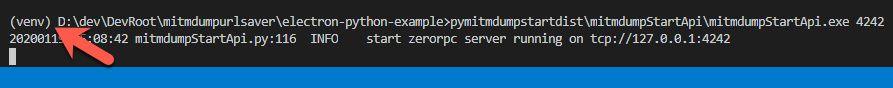
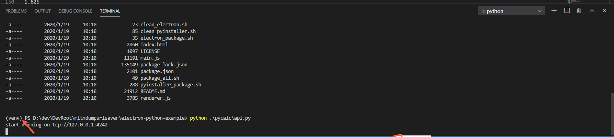

# virtualenv

`virtualenv`是目前流行度最高的Python虚拟环境管理工具之一。

最大特点，简单方便易用。

## 安装

```bash
pip install virtualenv
```

## 使用

* 概述
  * 创建：`virtualenv venv`
  * 进入：`source venv/bin/activate`
    * 管理库：用`pip`
      * 安装：`pip install xxx`
      * 保存虚拟环境=冻结依赖的库：`pip freeze > requirements.txt`
      * 恢复虚拟环境=恢复安装依赖的库：`pip install -r requirements.txt`
  * 退出：`deactivate`
  * 删除：`rm -rf venv`

### 创建虚拟环境

* 语法
    ```bash
    virtualenv YourVirtualEnvName
    ```
* 最常用写法
    ```bash
    virtualenv venv
    ```
  * 大家约定俗成把虚拟环境名称写成：`venv`
    * 你看到项目根目录下有个`venv`，往往就可以判断出，当前项目Python虚拟环境工具是`virtualenv`了
  * 举例
  ```bash
   virtualenv venv
  Using base prefix '/Users/limao/.pyenv/versions/3.8.0/Python.framework/Versions/3.8'
  New python executable in /Users/limao/dev/xxx/AppCrawler/venv/bin/python3.8
  Also creating executable in /Users/limao/dev/xxx/AppCrawler/venv/bin/python
  Installing setuptools, pip, wheel...
  done.
  ```

### 激活虚拟环境并进入

* 概述
  * `Mac/Linux`
    ```bash
    source venv/bin/activate
    ```
    * 或
        ```bash
        . venv/bin/activate
        ```
  * `Win`
    ```bash
    venv\Scripts\activate.bat
    ```
* 详解

| Platform | Shell | Command to activate virtual environment |
| -------- | ----- | --------------------------------------- |
| `POSIX` | `bash/zsh` | `$ source <venv>/bin/activate` |
|  | `fish` | `$ . <venv>/bin/activate.fish` |
|  | `csh/tcsh` | `$ source <venv>/bin/activate.csh` |
|  | `PowerShell Core` | `$ <venv>/bin/Activate.ps1` |
| Windows | `cmd.exe` | `C:\> <venv>\Scripts\activate.bat` |
|  | `PowerShell` | `PS C:\> <venv>\Scripts\Activate.ps1` |

* 说明
  * 进入虚拟环境后，你会看到，终端最前面多出个 `(venv)`，表示你进入了虚拟环境了。
    * 举例
      * `(venv)  limao@xxx  ~/dev/xxx/AppCrawler   master ● `
      * `(venv) D:\dev\DevRoot\mitmdumpurlsaver\electron-python-example>`
        * 
        * 

#### 确认Python版本

进入后，可以查看和确认，当前Python的版本和位置：

```bash
(venv) xxx  python --version     
Python 3.8.0
(venv)  xxx  which python
/Users/limao/dev/xxx/AppCrawler/venv/bin/python
```

#### 包管理器

其中包管理，可以用：[pip](https://book.crifan.com/books/python_summary_package_manager/website/pip/)

pip的位置和版本：

```bash
(venv)  xxx  which pip
/Users/limao/dev/xxx/AppCrawler/venv/bin/pip
(venv)  xxx  pip --version                                   
pip 20.0.2 from /Users/limao/dev/xxx/venv/lib/python3.8/site-packages/pip (python 3.8)
```

### 退出虚拟环境

```bash
deactivate
```

### 删除虚拟环境

如果要删除虚拟环境：直接删除当前虚拟环境的目录即可

命令：

```bash
rm -rf virtualenv_folder
```

典型的是：

```bash
rm -rf venv/
```

注：

* 其他很多虚拟环境工具，都是类似的逻辑，直接删除对应文件夹即可
  * `virtualenv`
  * `venv`
  * `Anaconda environment`
  * `pyenv`
* 而有些虚拟环境工具，是有专门的命令的（在虚拟环境根目录中执行）
  * `pipenv`
    * `pipenv --rm`
  * `virtualenvwrapper`
    * `rmvirtualenv`

## 附录

### 查看virtualenv版本

查看此处virtualenv工具的版本：

```bash
 virtualenv --version
16.7.9
```

### 文档

* 官方文档
  * Virtualenv — virtualenv 20.4.8.dev5+g5657d56 documentation
    * https://virtualenv.pypa.io/en/latest/
